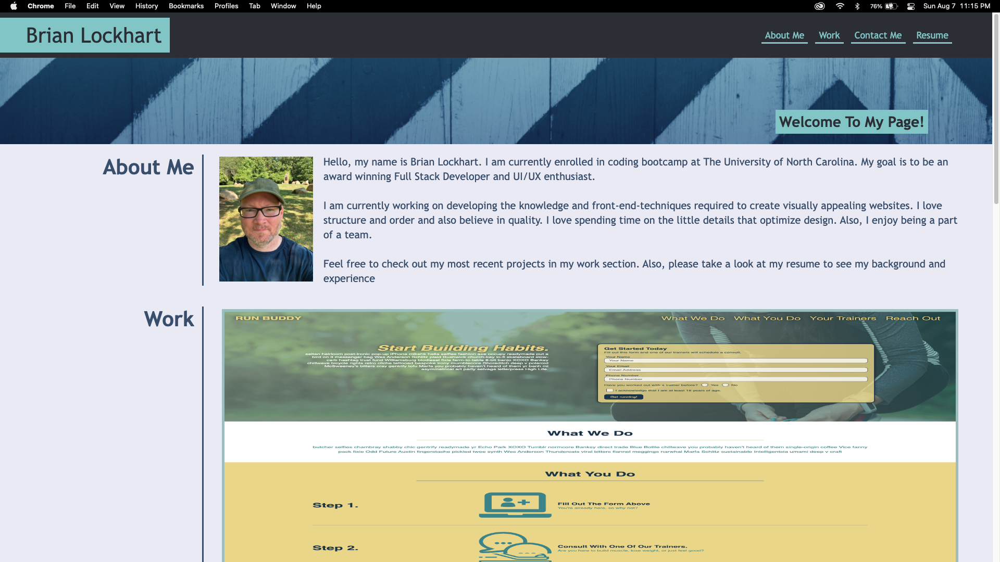

# Brian Lockhart Portfolio

## Description
A website to showcase my personal portfolio that can evolve as I progress in my studies. 
Initial design for the website is based off of a provided mock-up example on the websites 
appearance and funcitonality.
Used flexboxes to style layout, media queries to ensure responsiveness to multiple screen 
sizes, and advanced pseudo classes to add depth to the page.

## Table of Contents
* [Usage](#usage)
* [Links](#links)
* [Tools](#tools)
* [Credits](#credits)
* [Challenge Guidelines](#challenge-guidelines)
* [User Story](#User-Story)
* [Acceptance Criteria](#Acceptance-Criteria)
* [Steps](#Steps)
* [Technical Acceptance Criteria](#Technical-Acceptance-Criteria)
* [Deployment](#Deployment)
* [Application Quality](#Application-Quality)
* [Repository Quality](#Repository-Quality)
* [Submission](#Submission)

## Usage
Personal/for potential employers to see work:

## Links
### Deployed Portfolio Website:
* [Brian's Portfolio](https://bslockhart.github.io/Lockhart-Portfolio/)
### Links that Helped me along the way:
* [Youtube- Flexbox Design Patterns](https://www.youtube.com/watch?v=vQAvjof1oe4) 
* [Stack Overflow - Desaturating images](https://stackoverflow.com/questions/22994810/how-do-i-desaturate-and-saturate-an-image-using-css) 
* [W3Schools - Opacity with Box](https://www.w3schools.com/howto/tryit.asp?filename=tryhow_css_image_overlay_opacity)
* [Responsive Image Grid](https://www.w3schools.com/howto/howto_css_image_grid_responsive.asp)

## Tools
* HTML
* CSS

## Credits
GitHub: [Brian Lockhart](https://github.com/bslockhart)

## Challenge Guidelines
### Task:
Build portfolio of work samples

### User Story
AS AN employer
I WANT to view a potential employee's deployed portfolio of work samples
SO THAT I can review samples of their work and assess whether they're a good candidate for an open
position

### Acceptance Criteria:
GIVEN I need to sample a potential employee's previous work 
WHEN I load their portfolio
THEN I am presented with the developer's name, a recent photo or avatar, and links to sections about
them, their work, and how to contact them 
WHEN I click one of the links in the navigation
THEN the UI scrolls to the corresponding section 
WHEN I click on the link to the section about their work
THEN the UI scrolls to a section with titled images of the developer's applications 
WHEN I am presented with the developer's first application
THEN that application's image should be larger in size than the others 
WHEN I click on the images of the applications
THEN I am taken to that deployed application 
WHEN I resize the page or view the site on various screens and devices
THEN I am presented with a responsive layout that adapts to my viewport

### Steps:
* Use the Acceptance Criteria as a guide for how you'll plan deadlines, sketch, and code your portfolio.
* Ensure that your work meets the Acceptance Criteria and the full list of grading requirements.
* Reach out to your instructional support team throughout the week for help.
* Follow submission instructions.

### Technical Acceptance Criteria
* Satisfies all of the preceding acceptance criteria.

### Deployment
* Application deployed at live URL.
* Application loads with no errors.
* Application GitHub URL submitted.
* GitHub repository contains application code.

### Application Quality
* Application resembles the mock-up functionality provided in the Challenge instructions.

### Repository Quality
* Repository has a unique name.
* Repository follows best practices for file structure and naming conventions.
* Repository follows best practices for class/id naming conventions, indentation, quality comments, etc.
* Repository contains multiple descriptive commit messages.
* Repository contains quality readme with description, screenshot, link to deployed application.

### Submission
* The URL of the deployed application.
* The URL of the GitHub repository that contains your code. Give the repository a unique name and include a README file that describes the project.